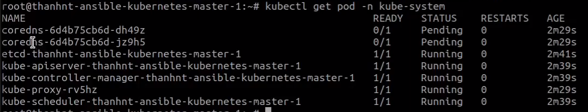
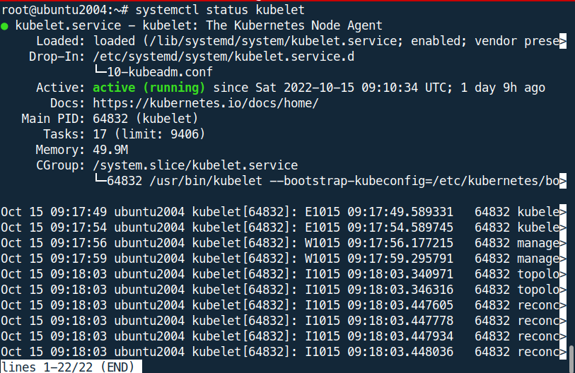

## create load balancer using nginx configuration
#### set up load balancer
1. initial nginx config on a VM machine
```shell
apt install -y nginx
cd /etc/nginx
mkdir k8s-lb.d
cd k8s-lb.d/
nano apiserver.conf
```
2. in `apiserver.conf` add the following
```
stream {
    upstream kubernetes {
        server master1_ip:6443 max_fails=3 fail_timeout=30s;
        server master2_ip:6443 max_fails=3 fail_timeout=30s;
    }
server {
        listen 6443;
        proxy_pass kubernetes;
    }
}
```
3. then add the line in the end of file `nginx.conf` in `/etc/nginx` with:
```
include /etc/nginx/k8s-lb.d/*;
```
4. reload nginx server:
```
nginx -s reload
```
> **_NOTE:_** from the under step both apply for master and workers (slaves)
## install containerd on master
1. create bash script to install containerd
```
nano install-containerd.sh
```
2. content in `install-containerd.sh`:
```
#!/bin/bash
cat <<EOF | sudo tee /etc/modules-load.d/containerd.conf
overlay
br_netfilter
EOF
sudo modprobe overlay
sudo modprobe br_netfilter
cat <<EOF | sudo tee /etc/sysctl.d/99-kubernetes-cri.conf
net.bridge.bridge-nf-call-iptables  = 1
net.ipv4.ip_forward                 = 1
net.bridge.bridge-nf-call-ip6tables = 1
EOF
sudo sysctl --system
sudo apt install containerd -y
mkdir /etc/containerd
containerd config default > /etc/containerd/config.toml
sed -i 's/SystemdCgroup = false/SystemdCgroup = true/g' /etc/containerd/config.toml
systemctl restart containerd
```   
3. run `install-containerd.sh`
```
bash install-containerd.sh
```
## Install kubeadm, kubelet, kubectl
1. create bash script to install kube machine
```
nano install-containerd.sh
```
2. run `install-kubeadm.sh`
```
#!/bin/bash
sudo apt-get update
sudo apt-get install -y apt-transport-https ca-certificates curl
sudo curl -fsSLo /usr/share/keyrings/kubernetes-archive-keyring.gpg https://packages.cloud.google.com/apt/doc/apt-key.gpg
echo "deb [signed-by=/usr/share/keyrings/kubernetes-archive-keyring.gpg] https://apt.kubernetes.io/ kubernetes-xenial main" | sudo tee /etc/apt/sources.list.d/kubernetes.list
sudo apt-get update
sudo apt-get install -y kubelet kubeadm kubectl
sudo apt-mark hold kubelet kubeadm kubectl
```
3. run `install-kubeadm.sh`
```
bash install-kubeadm.sh
```
## Init cluster on master
> **_NOTE:_** if you got bug when init kubeadm, run these command
> `kubeadm reset` and then rerun the init command
1.  give alias to load balancer server
```
echo "master_ip1 apiserver.lb" >> /etc/hosts
```
2. run ```kubeadm init --control-plane-endpoint=apiserver.lb:6443 --upload-certs --pod-network-cidr=10.0.0.0/8```
## Install cni using helm
### install helm
1. create bash script to install helm
```
nano install-helm.sh
```
2. content of `install-helm.sh` bash script
```
#!/bin/bash
curl https://baltocdn.com/helm/signing.asc | gpg --dearmor | sudo tee /usr/share/keyrings/helm.gpg > /dev/null
sudo apt-get install apt-transport-https --yes
echo "deb [arch=$(dpkg --print-architecture) signed-by=/usr/share/keyrings/helm.gpg] https://baltocdn.com/helm/stable/debian/ all main" | sudo tee /etc/apt/sources.list.d/helm-stable-debian.list
sudo apt-get update
sudo apt-get install helm
```
3. run `install-helm.sh`
```
bash install-helm.sh
```
### install cni
```
helm repo add cilium https://helm.cilium.io/
helm install cilium cilium/cilium --version 1.11.6 --namespace kube-system
```
> **_NOTE:_** coredns can't run if cni is not installed yet

1. to check k8s cluster status
```
export KUBECONFIG=/etc/kubernetes/admin.conf
```
2. Checking Kubernetes services status
```
kubectl get pod -n kube-system
```
## join master and workder to k8s cluster
### Add master node
```
kubeadm join apiserver.lb:6443 --token [token]  --discovery-token-ca-cert-hash sha256:[cert token] --control-plane --certificate-key [cert key]
```
### Add worker node
> **_NOTE:_** no need to add cert key in add woker node command (`control-plane` and `certificate-key` args )
```
kubeadm join apiserver.lb:6443 --token [token] --discovery-token-ca-cert-hash sha256:[cert token] 
```
## extra command
1. check token list on master node
```
kubeadm token list
```
2. create new token
```
kubeadm token create
```
3. Discovery token ca cert hash
```
openssl x509 -pubkey -in /etc/kubernetes/pki/ca.crt | openssl rsa -pubin -outform der 2>/dev/null | \
openssl dgst -sha256 -hex | sed 's/^.* //'
```
will give you cert token
4. create new cert key on master
```
kubeadm init phase upload-certs --upload-certs
```
5. check all node of kubernetes cluster
```
kubectl get node
```
6. check kubelet status
```
systemctl status kubelet
```
